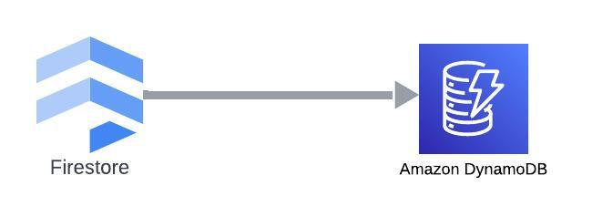

## Firestore-DynamoDB




To run migration create .env file with AWS and GCP credentials:
```bash
# acces keys
AWS_ACCESS_KEY_ID=
AWS_REGION=
AWS_SECRET_ACCESS_KEY=

# GCP PATH TO .json credentials
GOOGLE_APPLICATION_CREDENTIALS=
```
Also add firestore db and collection names as well as dynamodb table name:
```bash
# GCP
FIRESTORE_DATABASE=
FIRESTORE_COLLECTION=

# AWS
DYNAMODB_TABLE=
```

finally set bath size in .env for ingestion and loading
```bash
BATCH_SIZE=
```

Install required modules with:

```bash
pip install -r requirements.txt
```

And to migrate firestore -> dynamoDB run:

```bash
python main.py
```

*Firestore and DynamoDB got to have _id field for this migration to run successfully*

*Maybe later on I'll add DynamoDB -> Firestore migration feature*